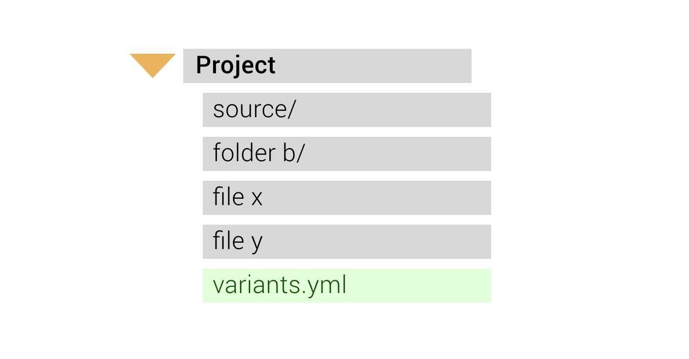

[](https://codecov.io/gh/Backbase/variants)
<p align="center">

</p>

## Variants

A command line tool to setup deployment variants and working CI/CD setup for mobile projects.

## Features

- ✅ Setup your mobile project to have multiple variants of the same application.
    - ➡️ Each variant having it's own:
        - Name
        - Identifier
        - Icon
        - Version
        - Specific tasks and configurations
        - Anything really!
- ✅ Setup CI/CD using fastlane.
    - ➡️ Lanes for specific tasks:
        - Setup CI
        - Create Keychain
        - Perform Unit and UI tests
        - Lint and format
        - Complexity analisys
        - Sonar report
        - Build and sign application
        - Deploy to AppCenter / PlayStore / AppStore
        - Many more!

## Installation

### Homebrew (recommended)

```sh
brew install backbase/m/variants
```

### Make

```sh
git clone https://github.com/backbase/variants.git
cd variants
make install
```

### Swift Package Manager

#### Use as CLI

```sh
git clone https://github.com/backbase/variants.git
cd variants
swift run variants
```

## Usage

```sh
Usage: variants <command> [options]

A command-line tool to setup deployment variants and working CI/CD setup

Commands:
  init            Generate specs file - variants.yml
  setup           Setup deployment variants (alongside Fastlane)
  switch          Switch variants
  help            Prints help information
  version         Prints the current version of this app
```

### Initialize

Before running setup to create your deployment variants and Fastlane setup you need a YAML configuration file.
Run `variants init` in the base folder of your project.

```sh
OVERVIEW: Generate spec file - variants.yml

USAGE: variants init [--platform <platform>] [--verbose]

OPTIONS:
  -p, --platform <platform>  'ios' or 'android'
  -v, --verbose 
  -h, --help                 Show help information.
      --version              Show the version.
```

Examples
```sh
# Automatically detect platform
$ variants init

# Specify platform (in case there are projects for different platforms in the working directory, this will be mandatory)
$ variants init --platform ios
```
It will generate a variants.yml file in the base folder of your project

<p align="center">

</p>

> NOTE: Edit the file variants.yml accordingly.

#### Config settings
Your `variants.yml` spec will contain all the necessary fields. The information within `xcodeproj` and `targets` sections are populated automatically if a `.xcodeproj` is found in your working directory - otherwise, you'll be asked to update the placeholders in this file. It comes with one variant named `default`, which will be used whenever a variant isn't specified. You can then include custom variants, for which the following settings are required:
* `name`
* `version_name`
* `version_number`

```yaml
ios:
    xcodeproj: SampleProject.xcodeproj
    targets:
      SampleProject:
        name: SampleApp
        bundle_id: com.sample.app
        app_icon: AppIcon
        source:
          path: Sources
          info: Sources/Info.plist
          # Path to folder that will serve as parent to folder Variants/
          config: Sources
    variants:
        # Default variant is mandatory, do not remove
      - name: default
        version_name: 0.0.1
        version_number: 1
        custom:
            - key: apiBaseUrl
              value: https://sample.com/
      - name: BETA
        id_suffix: beta
        app_icon: AppIcon.beta
        version_name: 0.0.1
        version_number: 13
        custom:
            - key: apiBaseUrl
              value: https://sample-beta.com/
            - key:  OTHER_SWIFT_FLAGS
              value: $(inherited) -DBETA
            
```

### Setup multiple build variants with full fastlane integration.

#### Using default configuration file (variants.yml)

```sh
OVERVIEW: Setup deployment variants (alongside Fastlane)

USAGE: variants setup [--platform <platform>] [--spec <spec>] [--skip-fastlane] [--verbose]

OPTIONS:
  -p, --platform <platform>  'ios' or 'android'
  -s, --spec <spec>          Use a different yaml configuration spec (default: variants.yml)
      --skip-fastlane
  -v, --verbose
  -h, --help                 Show help information.
      --version              Show the version.
```

Examples
```sh
# Automatically detect platform
$ variants setup

# Specify platform (in case there are projects for different platforms in the working directory, this will be mandatory)
$ variants setup --platform ios
```

This will generate your `Variants/` folder, containing `variants.xcconfig` and `Variants.swift`. You won't have to do anything with these files.
`Variants.swift` is an extension in case you need any of the variant's configuration in your codebase:
```swift
let baseUrl = Variants.configuration["apiBaseURL"]
```

Setup will also configure your Xcode project to use this new configuration and map configs (such as `name`, `bundle_id`, `app_icon`, `version_name` and `version_number`).

<p align="center">

</p>

#### Using a configuration file other than the default one

You might not always have `variants.yml`  in the base folder of your project or have it with a completely different name, for this reason you can specify its path as an option

```sh
variants setup -s (or --spec) <yml spec path>

variants setup -s ~/johndoe/custom/path/variants.yml
```

> NOTE: *variants setup* will automatically assign the `default` variant configuration to the project

### Switch variants

In order to switch between project variants you don't need to modify the Xcode project nor the `variants.xcconfig`, just make use of one command

```sh
OVERVIEW: Switch variants

USAGE: variants switch [--variant <variant>] [--platform <platform>] [--spec <spec>] [--verbose]

ARGUMENTS:
  <variant>

OPTIONS:
      --variant <value>       Desired variant (default: default)
  -p, --platform <platform>   'ios' or 'android'
  -s, --spec <spec>           Use a different yaml configuration spec (default: variants.yml)
  -v, --verbose
      --version               Show the version.
  -h, --help                  Show help information.
```

Examples
```sh
# Automatically detect platform
$ variants switch --variant beta

# Specify platform (in case there are projects for different platforms in the working directory, this will be mandatory)
$ variants switch --variant beta --platform ios
```

## Auto detecting the project's platform

All commands (`init`, `setup` and `switch`) are capable of detecting your mobile project's platform (`iOS` or `Android`).
However, you can specify a platform directly, with option `--platform <value>` where value is either `ios` or `android`.

```sh
# Auto detection will happen
$ variants <command>

# Platform is specified, skip auto detection
$ variants <command> --platform ios
$ variants <command> --platform android
```

### Unable to auto detect platform

There are 2 cases when platform auto detection will present a problem.

1. No Android nor Xcode project were found in the working directory

```sh
$ variants switch --variant beta
INFO  [2020-10-21]: ▸ --------------------------------------------------------------------------------------
INFO  [2020-10-21]: ▸ $ variants switch --variant beta
INFO  [2020-10-21]: ▸ --------------------------------------------------------------------------------------
Error: ❌ Could not find an Android or Xcode project in your working directory.
```

2. When both an Android and a Xcode project were found in the working directory, making it unable to decide which platform to use for a command.

```sh
$ variants switch --variant beta
INFO  [2020-10-21]: ▸ --------------------------------------------------------------------------------------
INFO  [2020-10-21]: ▸ $ variants switch --variant beta
INFO  [2020-10-21]: ▸ --------------------------------------------------------------------------------------
Error: ❌ Found an Android and Xcode project in your working directory. Please specify the platform you want using `--platform <value>`
```
